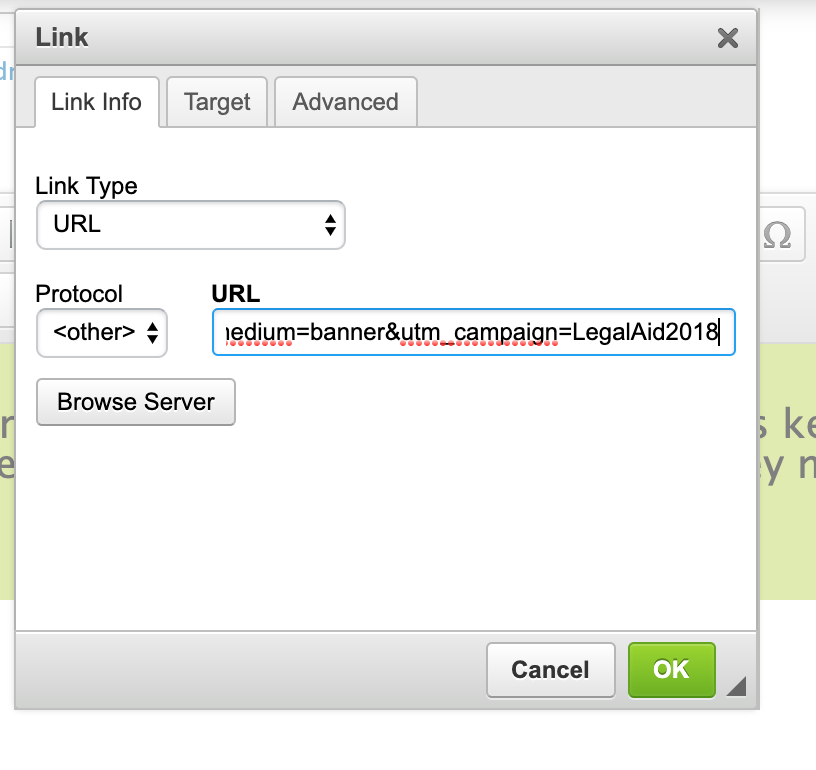
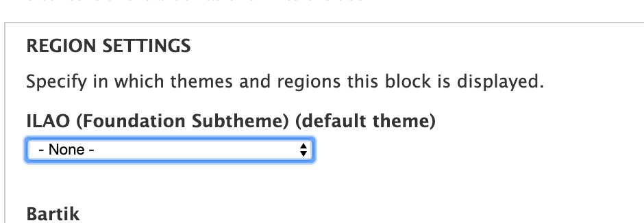

=========================
Managing Donor Appeals
=========================

Code exists to set a cookie for people who visit our donate page.  It is cleared out every 30 days.  If this cookie exists on a user's browser, they will not see the appeal banner.

Setting up the appeals blocks
==============================

We have 3 appeals blocks created, each of which is audience-based:

* `Advocate block <https://www.illinoislegalaid.org/admin/structure/block/manage/block/371/configure>`_
* `Pro bono block <https://www.illinoislegalaid.org/admin/structure/block/manage/block/406/configure>`_
* `Public block <https://www.illinoislegalaid.org/admin/structure/block/manage/block/401/configure>`_

Edit each block and set the donation message.  In the Block body editor, edit the message.  

1. On the button, right click and set "edit link"

.. image::  assets/donate-edit-link.png

2. In the url, edit the utm-campaign at the end of the url

Each appeal campaign should have a single campaign name that is different appeal to appeal.  Combined with the defined source and medium, we can track the banner in Google Analytics.

3. Assign the block to the "featured" region in the ILAO theme:

..image:: assets/donate-edit-region.png

4. Save the block.

Repeat for each block.

Taking the appeals blocks down
================================

To remove the appeal blocks from the website, for each of the blocks listed above,

1. Assign the block to the "none" region in the ILAO theme:

2. Save the block.

