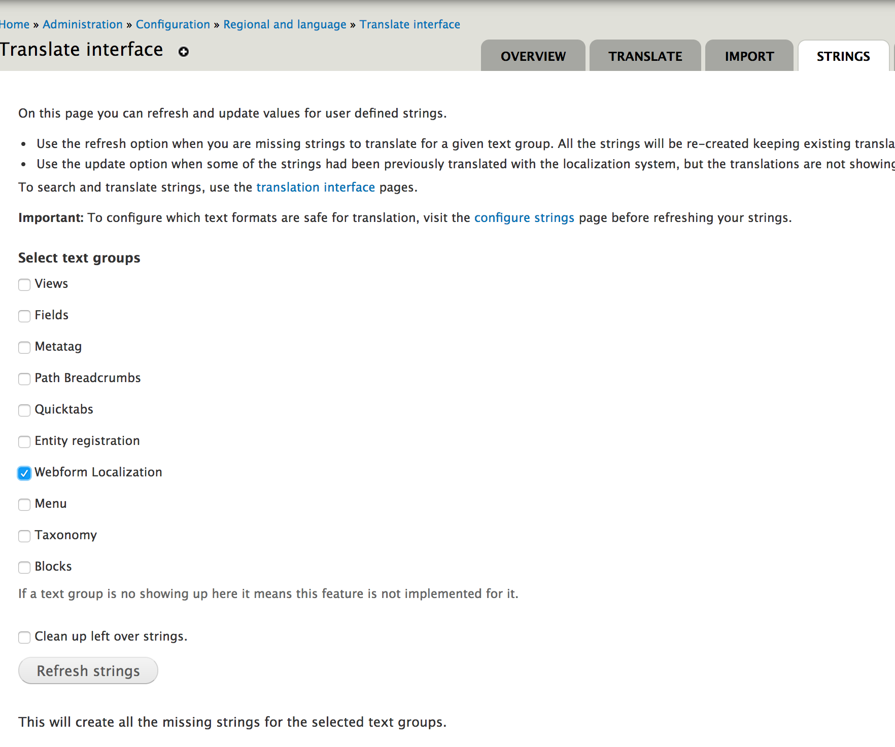

======================================
Automatic translation of triage rules
======================================

When triage rules are initially created, a notification is sent to Gwen and Teri to set up translation.  To do this, for each set of rules:

* Go to the triage rules
* Click translate
* Add the translation for Spanish (just click add translation and then save the page
* Click on webform
* Click on form settings
* Set the localization by string translation to "Expose webform component strings suitable for translation

Then you need to tell Drupal that we have new webform strings.  If you are enableing translations for multiple sets of triage rules, do this after completing the step above for each step

* Go to the `translate interface <https://www.illinoislegalaid.org/admin/config/regional/translate>`_ page and click Strings
* Check webform localization
* Uncheck clean up left over strings
* Click "Refresh strings"

Then go to our `Lingotek admin page for configuration <https://www.illinoislegalaid.org/admin/settings/lingotek/manage/config>`_.  It will likely default to show all the missing translations

* Set the pager at the bottom to 100
* Check all the components on the page
* Under actions, select "Upload to lingotek"
* Wait 5 minutes
* Under actions, select "Download all translations"

.. image:: assets/lingotek_config.png 

 
