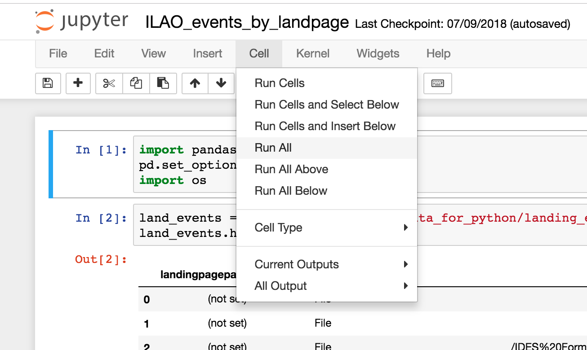

==========================
Recommendation Algorithm
==========================

The recommendation algorithm creates a CSV file of recommendations that can then be imported into the website.  On pieces of legal content that have recommendations, the "Related" block is replaced with the "Recommended for you" block.

To generate updated recommendations, one must:

* Create csv files for data pulled from Google Analytics
* Generate a new category file from the website
* Run the python script to generate a new CSV file of recommendations
* Import the file into the website

Google Analytics Data Files
============================

There are 3 Google analytics files that need to be created and then copied into the recommender/data/data_for_python folder.

.. note:: You will need to set the start date, end date, and Google property data for these reports.  You will also need to fix the heading labels and add the start and end date columns.

landing_events
---------------

The landing_events.csv file has the following column headings:

* landingpagepath
* eventcategory
* eventlabel
* totalevents
* uniqueevents
* sessionswithevent
* start_date
* end_date

Link to Google analytics query: https://ga-dev-tools.appspot.com/query-explorer/?start-date=2017-01-01&end-date=2018-10-31&metrics=ga%3AtotalEvents%2Cga%3AuniqueEvents%2Cga%3AsessionsWithEvent&dimensions=ga%3AlandingPagePath%2Cga%3AeventCategory%2Cga%3AeventLabel&filters=ga%3AeventCategory!%40404&include-empty-rows=false&start-index=1&max-results=15000

This is likely to generate more than 10000 records.  Each set can be downloaded as a tsv file, opened in Excel and the results concatenated into a single CSV sheet.

pagepath_duration
------------------
The pagepath_duration.csv file has the following column headings:

* pagepath
* sessions	
* avgsessionduration
* start_date
* end_date

Link to Google analytics query: https://ga-dev-tools.appspot.com/query-explorer/?start-date=2017-01-01&end-date=2018-10-31&metrics=ga%3Asessions%2Cga%3AavgSessionDuration&dimensions=ga%3ApagePath&sort=-ga%3AavgSessionDuration&filters=ga%3Asessions%3E0%3Bga%3AlandingPagePath%3D%40%2Flegal-information%2F&include-empty-rows=false&start-index=1&max-results=15000

pagepath_eventlabel
---------------------

The pagepath_eventlabel.csv file has the following column headings:
* pagepath
* eventcategory
* eventlabel
* uniqueevent
* sessionswithevent
* totalevents
* start_date
* end_date

Link to Google analytics query: https://ga-dev-tools.appspot.com/query-explorer/?start-date=2017-01-01&end-date=2018-10-31&metrics=ga%3AtotalEvents%2Cga%3AuniqueEvents%2Cga%3AsessionsWithEvent&dimensions=ga%3ApagePath%2Cga%3AeventCategory%2Cga%3AeventLabel&filters=ga%3AeventCategory!%40404&include-empty-rows=false&start-index=1&max-results=15000 

Category CSV
===============

The just_cats_filt.csv file contains all of our legal content urls and the primary legal category they are tied to.  It has 3 columns:
* url
* url_subpath (url without the domain part)
* subgroup (primary legal category)

The report can be exported `from the website. <https://www.illinoislegalaid.org/admin/content-categories/csv>`_

This file should also be saved to the recommender/data/data_for_python folder.

Running the Python Script
==========================

To run the python script, the `Anaconda python package <https://www.anaconda.com/download>`_ should be installed on the machine you are running the script from.

Once installed:

* Open the Anaconda navigator
* Launch the Jupyter notebook
* Navigate to the recommender folder and in the python folder, there is a file named ILAO_events_by_landpage.ipynb
* Open the ILAO_events_by_landpage.ipynb file
* Click on Cell, Run all
* It will take a few minutes but the new recommendations file will be generated and saved to the recommender/rec_csvs folder.

Import the recommendations
============================

To import the recommendations:
* Take the site offline (put it in maintenance mode)
* Back up the database
* Go to https://www.illinoislegalaid.org/import
* Open the recommend import
* Set the file encoding to "auto"
* Select the file to import

If it stalls, restore the database and try again.  Sometimes removing landing pages that are not nodes helps.

.. image:: assets/recommend-importer.png

Older technical information
============================

..  toctree::
    :maxdepth: 1
    
    rec_overview_civis
    rec_getting_datasources
    rec_processing_sql
    rec_processing_python

      
