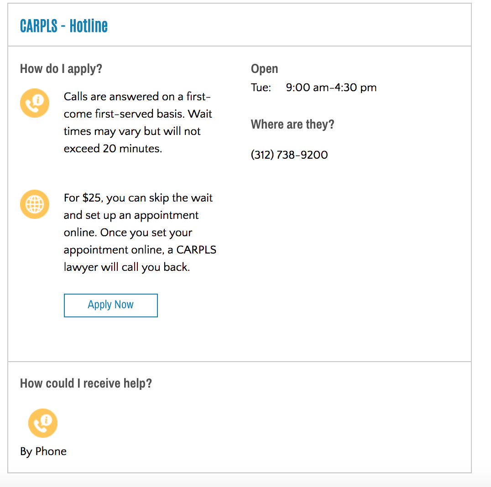

=======================
Referral Listings
=======================

List of referrals
===================
The referral listings are ordered so that:

Each referral listed in the list of referrals includes:

* the name of the organization
* the name of the service
* information on how to apply.  This is taken from the application process field.  Notes on how to apply are also included.
* the next time they are open, if included.  For services that are 24/7, these will display with the text "this service never closes" 
* contact information.  This may include:
  
  * a phone number, if the service is delivered by phone
  * address and map, if the serivce is delivered in person

* how service may be delivered (in person, online, phone)

   A sample listing

Individual profiles
====================
