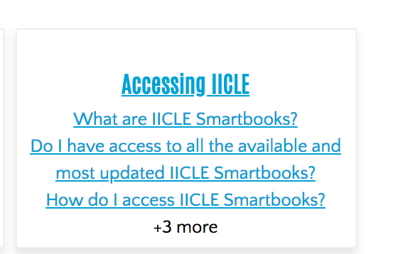

======================
Site FAQs
======================

The Site FAQs is a content type we use to provide a library of questions about ILAO's services and products.  The Site FAQs should be:

 * written for end users
 * be written in plain language
 * be platform neutral (should be correct for mobile, tablet, and desktop users) * relevant to the user (FAQs that relate to restricted functions should be restricted to users with those roles)
 * ordered in a meaningful way

The Site FAQ content type has the following fields:
 * Title - this should be the question 
 * Answer - this is a WYSIWYG field to answer the question.  Screenshots may be added as needed.
 * Category - the Site FAQ category to which the FAQ belongs.  This controls where the FAQ is displayed.  For example, questions under "Get Legal Help" will show on the sidebar in Get Legal Help.
 * Row weight - this is used to sort FAQs.  Lower numbered FAQs appear above higher numbered FAQs

.. note:: FAQs without a row weight  will float higher than those with a row weight as empty is treated as "lower" than with a value.  For FAQ taxonomy terms where order is important, we need to add row weights to each question.

Site FAQ Cards
===============

The main site FAQs page displays pages of all taxonomy terms in the Frequenty Asked Questions taxonomy that have questions.  It displays 3, ordered by *row weight*.  It includes a count of the number of additional questions, if there are more than 3.  

The cards only show questions that the user has access to.  For example, the Using IICLE category has questions that are only relevant to advocate users and are only visible to them.

   Advocate users see more questions when viewing the Using IICLE card than anonymous users (below).

.. image:: assets/site-faq-card-anonymous.png

Searching FAQs
---------------

From the site FAQ card page, users can also search within the site FAQ library.

Taxonomy term page
===================

The taxonomy term page contains the list of all questions in a given category that the user has access to.  The questions are ordered by row weight.

On the left (or below the list on mobile) are links back to all of the other Site FAQ categories).

Question pages
=============== 

Individual quesion pages include the share bar.  

.. note:: Comments were removed from FAQs in release 2.19.0.  This was done because they were not being used to leave comments on the FAQs but to ask for legal help or were spam.

Each question page also contains a list of the other FAQs that share that taxonomy term, ordered by row weight. 
