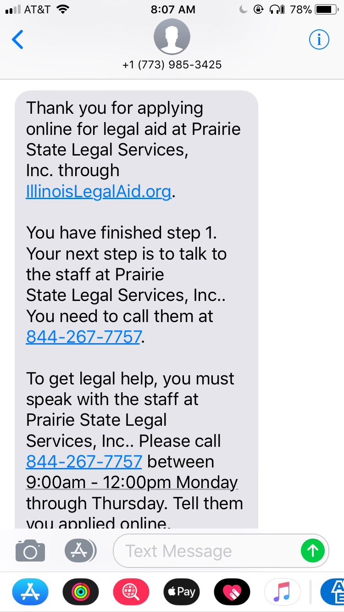

===================================
SMS OTIS Confirmations & Reminders
===================================

SMS is integrated with our Online Triage & Intake System (OTIS) in three ways when a user has opted-in to receive OTIS-related messages:

* when a user completes an online intake, the receive their confirmation message in both email and SMS
* when a user completes an online intake where they schedule an appointment with a program, they receive reminders
* users receive follow-up system surveys that are targeted to get legal help users.

Confirmation messages
======================

Users who opt-in to SMS receive an immediate SMS confirmation message.  The message is pulled from each program's intake settings.  If the user applied and selected call back times, those are also listed.

   Sample text confirmation when user calls program.
   
Reminders
==========
The system will automatically send appointment reminders when:

* the user scheduled one or more times for the program to call them
* the user has opted-in to SMS through online intake

Reminders are sent:

* 24 hours before the first callback time
* 1 hour before the first callback time

.. note:: Example: User A schedules a callback for Wednesday, September 13 at 1:00pm or Thursday, September 14 at 9:--am.

          The user will get a 24 hour reminder at 1:00pm on September 12 and a 1 hour reminder at 12:00pm on September 12

Follow-up surveys
==================      

Follow up surveys may be sent using the `SMS Surveys <sms_surveys.html>`_ platform.  Surveys are sent to OTIS users when:

* the primary user type for the survey is "Get used legal help"
* the user meets the "send on conditions" for the survey
* the user has opted in for SMS through online intake

   