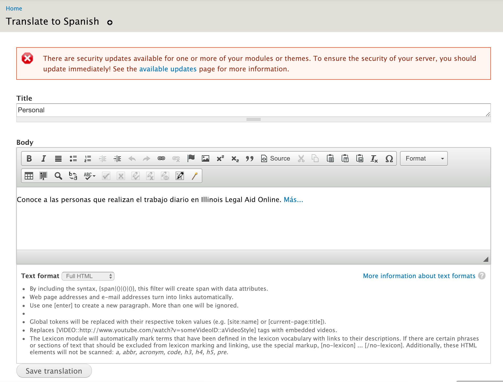
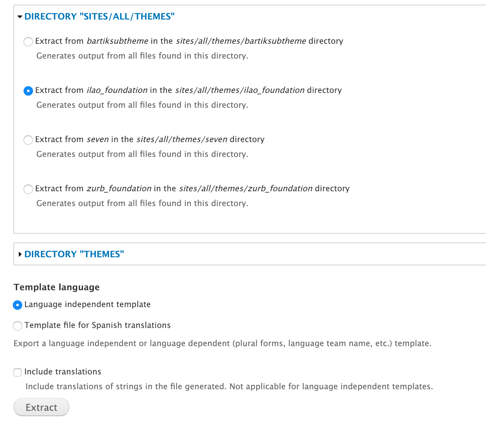

==================================
Translating interface components
==================================

What is Interface Translation?
===============================

Interface includes pretty much everything that is not content (of any type) and includes:

* Blocks
* Menus
* Taxonomy terms
* System interface (including translatable strings contained in code)
* Views
* Custom code (including strings in custom modules and our theme

How is it Translated?
======================

Interface text can be translated in a few different ways:

* By translating directly in the translate page under Configuration/ Translate Interface/ Translate (https://www.illinoislegalaid.org/admin/config/regional/translate/translate)
* For blocks, menus, and taxonomy terms, by translating in-line
* By exporting or extracting strings to a PO file, translating offline and re-importing 

Single Strings Through the UI
------------------------------

Go to Configuration and then `Translate interface <https://www.illinoislegalaid.org/admin/config/regional/translate>`_.

Then click on the translate tab:

.. image:: assets/tmgmt-translate.png

You can filter on language, whether the string has already been translated, and text groups.

Filtering on the string is *case sensitive.*  Please, please, PLEASE are all considered different words.

Blocks
----------
This applies to blocks that are created in the UI.  Some blocks are views and some are custom and must be managed via the custom modules and PO edit sections.

Configuring Translation 
~~~~~~~~~~~~~~~~~~~~~~~~
Blocks need to be affirmatively made translatable in order to translate them.

On the block's edit form, click on Languages and check the "Make this block translatable" box:

.. image:: assets/block-translatable.png

Some blocks may only be relevant in one specific language.  In that case, also check which language(s) it should appear for.

Translating
~~~~~~~~~~~~

Start by accessing the `list of blocks <https://www.illinoislegalaid.org/admin/structure/block>`_ (or mouse over the block you want to edit and click on the little gear and select "Translate"

.. image:: assets/blocks-list.png

Select "Configure" next to the block.  *If you don't see a block title and body block, you can not manage the translation this way.*

Click on the translate tab

.. image:: assets/block-translate1.png

Next to the language select "Add translation" or "Edit" (if a translation exists):

Enter or update the translation and save.

Menus
-------

Ask Gwen to set up translation for menus as they require some additional configuration.

For translatable links
~~~~~~~~~~~~~~~~~~~~~~~

Translatable links are set up as "language neutral" and then have translations associated with them.
But once set up, menus follow the same methodology as blocks but are accessed via the `Menu section <https://www.illinoislegalaid.org/admin/structure/menu>`_ .

From the menu list, pick the menu you want to edit

Then list links and next to each link, translate.

Language-specific links
~~~~~~~~~~~~~~~~~~~~~~~~

For menu links that need to link to language-specific resources (for example, Facebook on the footer), menus support links that are language-specific. 

See Gwen for configuring those 

Views, Taxonomy, Breadcrumbs, etc
----------------------------------

The easiest way to translate views, such as the legal information pages, taxonomy terms, and breadcrumbs is to do this in PoEdit.

Step 1:  Make sure your strings are up to date.
~~~~~~~~~~~~~~~~~~~~~~~~~~~~~~~~~~~~~~~~~~~~~~~~

* Go to the `Translate interface <https://www.illinoislegalaid.org/admin/config/regional/translate>`_ section and click on the "Strings" tab
* Check all the checkboxes
* Click Refresh strings

.. image:: assets/translate-strings.png

Step 2: Export what you need
~~~~~~~~~~~~~~~~~~~~~~~~~~~~~~

For each type, you'll need to export a separate PO file.  Go to the `Translate interface <https://www.illinoislegalaid.org/admin/config/regional/translate>`_ section and click on the "Export" tab.

In the top section, pick the language you need and then select a text group and press the first Export button.  Ignore the bottom of the page.

Step 3: Edit in POEdit
~~~~~~~~~~~~~~~~~~~~~~~~~

See the POEdit information on this page.  Make your edits and then save the .po file.

Step 4:  Import the file
~~~~~~~~~~~~~~~~~~~~~~~~~

Go to the `Translate interface <https://www.illinoislegalaid.org/admin/config/regional/translate>`_ section and click on the "Import" tab.

Be sure to pick the text group that matches what you exported. 

* Add the language file
* Pick the language to import into
* Pick the text group
* Set the mode to "Strings in the uploaded file replace existing strings, new ones are added.  The plural format is updated." if you made changes to existing translations.  Otherwise, use the Existing strings and the plural format are kept, only new strings are added.
* Click Import

.. image:: assets/import-modules.png

Custom modules & ILAO themes
----------------------------

Extract files
~~~~~~~~~~~~~~~

These need to be extracted and edited in POEdit and then imported.

Go to the `Translate interface <https://www.illinoislegalaid.org/admin/config/regional/translate>`_ section and click on the "Extract" tab

Extract what you want to translate:

* Custom modules are in sites/all/modules/custom
* Theme (templates) are in sites/all/themes/ilao_foundation

You want to

* Select template file for [x] translations
* Include existing translations

Import files
~~~~~~~~~~~~~~

Theme and module importa are part of the "Built-in interface" text group.  To import:
Go to the `Translate interface <https://www.illinoislegalaid.org/admin/config/regional/translate>`_ section and click on the "Import" tab

* Add the language file
* Pick the language to import into
* Leave the built-in interface checked
* Set the mode to "Strings in the uploaded file replace existing strings, new ones are added.  The plural format is updated.
* Click import

.. image:: assets/import-modules.png

 

Working with PO files & POEdit
------------------------------

When you extract or export a file, it will generate a .po file.  Open that in PoEdit and add or update the existing translations.

Once you are done, import the file (see Import files under custom modules & ILAO themes

.. image:: assets/po-edit.png

