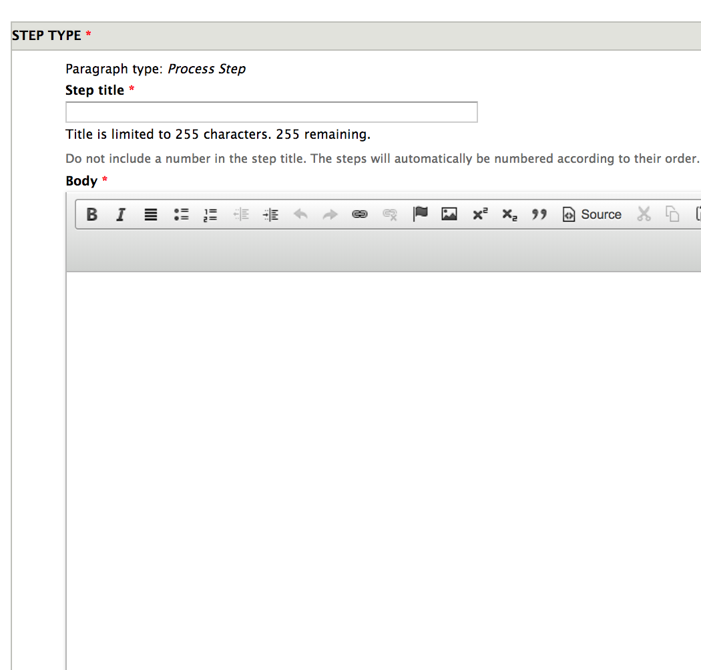
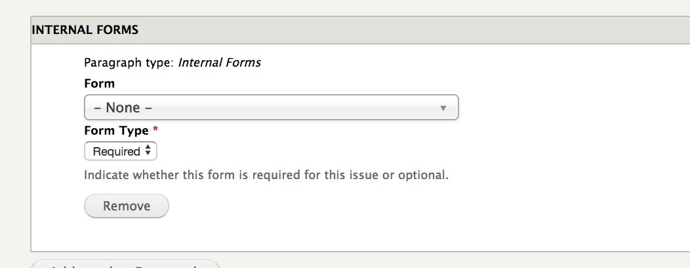
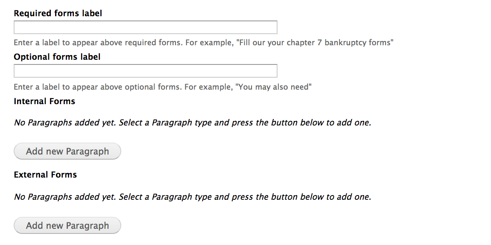
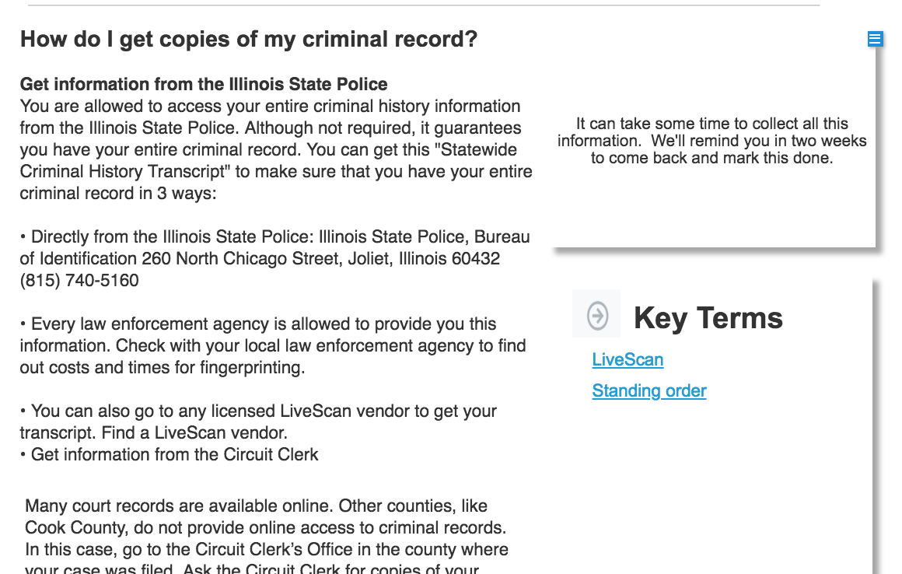

==========================
Tool Step Content Type
==========================

The tool step is the most granular page in the Toolbox framework.  Tool steps are either:

* a discrete step in the process
* a decision point

A tool step should contain:

* A title
* A yes/no as to whether the step is always required.  If the step is not always required, an explanation of when the step is/is not required must be provided.
* A step type.  This is the main body of the page and should be limited to one per page. A step type would be one of the following:

  * Webform
  * Single form
  * Multiple form
  * Process step

* Optionally, one or more tool step components.  These include:
  
  * Callout
  * Key terms component
  * Short answer component
  
* Tickler settings.  This allows us to set reminders via SMS and/or email.  Each tickler must include:

  * Trigger date.  This is either [x] days from the completion timestamp of the previous step or [x] days from the completion of the current timestamp.
  * An SMS message.  This will get sent to users who have opted in to SMS based on the trigger date.
  * An email message, with subject and body.  This will get sent to users who have opted in to email notifications based on the trigger date.

* An indication if this is the last step in the process.
* Whether to include a learn more component
* The tool to which the step belongs

Step Types
=============

Process Step
-------------

The basic step type is the **process step**.  This is similar to the process step used in legal content.  

A tool step should **never** have more than one process step. 

Webform
---------

Coming soon!

Fill out forms (single)
------------------------
When using this component, you must select from published forms on our website.  This will then generate a page layout similar to the one below, pulling in key components from the content so that they do not have to be entered more than once.

.. figure:: assets/toolbox-single-form-output.png

   Example of automated form used in fill out forms (single)
   
.. warning:: Because of field sharing, this will technically allow you to add more than one form.  **Don't**.  The page will render badly if you do.  Use the multiple form if you need more than one required form or if you need to use external forms.

Fill out forms (multiple)
--------------------------
The fill out forms (multiple) can be used to create lists of forms that need to be filled out.  Forms can be grouped as required or as optional and the system supports internal and external forms.

   Multiple form admin component
   
A multiple form component requires that you:

* Provide a label for the required forms.  This will appear above the list.  For example:  You must fill out the following forms: or Fill out your chapter 7 forms:
* Provide a label for the optional forms.  This will appear above the list of optional forms, if optional forms are included.  For example:  You may also need:
* Add one or more internal or external forms.  Adding an internal form works just like the fill out forms (single).  External forms require:
  * a title.  This is the name of the form
  * the url to the form
  * a description of the form
  * whether the form is optional or required.
  
Forms can be reordered so that they appear as you want but will be grouped together as required or optional.  

.. warning:: There are form callout fields in the fill out forms components currently. Those will be deprecated and removed in favor of the tool component callout instead. **DO NOT USE**

Tool Step Components
=======================
We currently support 3 tool step components on the page:

* Callout
* Key terms component
* Short answer component

Callout
-------------
Use the callout to highlight key pieces of information.  

   This image includes a simple callout with just a body.  Also shown is one view of the key terms.

Callouts may have a title and must have a body.  They may also use a portal icon and may be positioned above or below the content (on desktop, call outs will be positioned to the right of the page component; on mobile, above or below)

Key Terms component
--------------------
The key terms component can be used in place of defining terms within the step but where the definition shouldn't be part of the standard glossary.  Each key term:

* term
* description (definition)

You can add multiple key terms components.  The system will group them together and display just the terms in a block.  When a user clicks on a term, it will expand to show the definition.

Short answer component
-----------------------

A short answer component can be used a sort of mini-FAQ or other grouped cluster of information.

.. image:: assets/toolbox-step-short-answer.png

The component has a label, which defaults to Commonly asked questions.  This is the header for the section.

Then you can add one or more component.  Each component has:

* a title
* a body, which is limited to 250 characters.  

The component will be displayed to the right of the body of the page and lists each component label.  When clicked, the body displays.

Tickler Settings
===================

The tickler settings field allows us to set one or more triggers that will send the user an offline message if they have notifications enabled.  Messages may be either SMS or emails.

.. image:: assets/toolbox-step-tickler.png

For each tickler you must;

* Define the number of days after an event in which to trigger the message
* Define the trigger type.  This is the event that the number of days is based off of.  The trigger types are:

  * From the end date of the last step. 
  * From the end date of this step
  * From the visit date of the last step, if not completed. (not built yet)
  * From the visit date of the current step, if not completed. (not built yet)
  
* The SMS message to send.  This is limited to 160 characters currently to ensure the message is a single text message.
* The email to send.  This includes both a subject and a body. The subject is limited to 100 characters and the body to 500.

.. note::
   For example, in Step 1, we tell the user to gather their documents; Step 2 they fill out their forms, and Step 3 they file their forms.  
   
   A tickler may be set up in Step 2 that trigger 10 days after the user completes Step 1 to remind them to come back and fill out their forms. 
   
   A second tickler that fires 5 days after they visit Step 2 to remind them to ask if they filled out their forms.
   
   